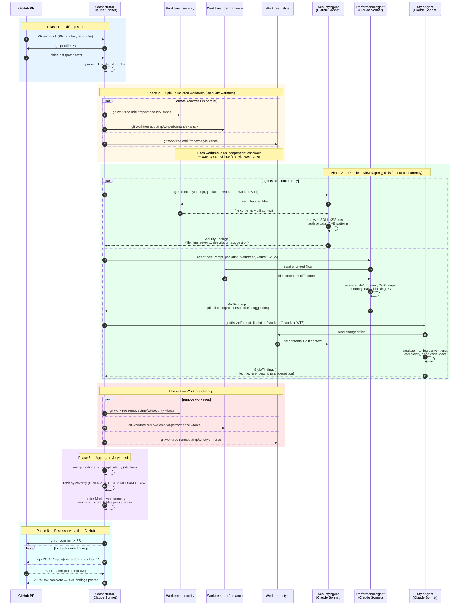

# Multi-Agent Code Review System — Communication Flow

## Flow summary

| Phase | Actor | Action |
|-------|-------|--------|
| 1 | Orchestrator | Receives PR webhook, fetches unified diff via `gh pr diff` |
| 2 | Orchestrator | Creates 3 independent git worktrees (`isolation: worktree`) |
| 3 | Security / Perf / Style agents | Run **in parallel**, each in its own worktree — zero cross-contamination |
| 4 | Orchestrator | Removes worktrees after agents complete |
| 5 | Orchestrator | Merges & deduplicates findings, ranks by severity |
| 6 | Orchestrator | Posts an overall summary comment + per-line inline comments to the PR |
